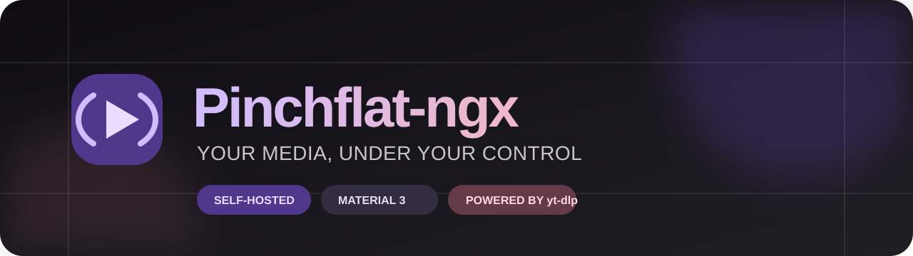

<p align="center">
  
</p>

<p align="center">
  <a href="https://github.com/TheBadFella/PinchYT/releases"></a>
  <a href="https://github.com/TheBadFella/PinchYT/actions/workflows/lint_and_test.yml"></a>
  <a href="LICENSE"></a>
  
</p>

<p align="center">
  A self-hosted YouTube media manager built on Pinchflat, with a Material 3 AMOLED interface,<br>
  stronger source controls, and practical tools for running a hands-off media library.
</p>

> [!IMPORTANT]
> PinchYT is an independent, personal fork. [Pinchflat](https://github.com/kieraneglin/pinchflat) remains the upstream
> project and the foundation of its download model.

## Get started

| 1 · Deploy                                                                           | 2 · Configure                                                                            | 3 · Build your library                                                    |
| :----------------------------------------------------------------------------------- | :--------------------------------------------------------------------------------------- | :------------------------------------------------------------------------ |
| Run the multi-platform image from GHCR.                                              | Set your timezone and choose Basic Auth or OIDC.                                         | Create a media profile, then add a channel, playlist, or video.           |
| **[Installation guide →](https://github.com/TheBadFella/PinchYT/wiki/Installation)** | **[Configuration →](https://github.com/TheBadFella/PinchYT/wiki/Environment-Variables)** | **[Pinchflat concepts →](https://github.com/kieraneglin/pinchflat/wiki)** |

```yaml
services:
  pinchyt:
    image: ghcr.io/thebadfella/pinchyt:latest
    environment:
      TZ: America/Regina
    ports:
      - '8945:8945'
    volumes:
      - ./config:/config
      - ./downloads:/downloads
    restart: unless-stopped
```

Save this as `compose.yaml`, replace the timezone if needed, and run `docker compose up -d`. Open
<http://localhost:8945> when the container is healthy.

## What PinchYT adds

<table>
  <tr>
    <td width="33%" valign="top">
      <h3>📚 Sources</h3>
      More ways to add media, decide what downloads, and control where files land.
    </td>
    <td width="33%" valign="top">
      <h3>✨ Interface</h3>
      A focused Material 3 AMOLED experience across desktop and mobile.
    </td>
    <td width="33%" valign="top">
      <h3>⬇️ Downloads</h3>
      Better visibility, safer retries, and settings for real-world YouTube access.
    </td>
  </tr>
  <tr>
    <td width="33%" valign="top">
      <h3>🛠️ Operations</h3>
      Queue controls, diagnostics, structured logs, and adjustable workers.
    </td>
    <td width="33%" valign="top">
      <h3>🔐 Access</h3>
      Optional OAuth2/OpenID Connect login without breaking podcast clients.
    </td>
    <td width="33%" valign="top">
      <h3>📦 Delivery</h3>
      Versioned, multi-platform container images published through GHCR.
    </td>
  </tr>
</table>

### Sources

- **Single video sources:** Add one-off YouTube video URLs directly instead of treating everything as a channel or
  playlist.
- **Selective playlist downloads:** Index a playlist, review its items, and choose exactly what to fetch from the
  Selection flow.
- **Stronger source controls:** See automatic and delayed sources at a glance, with inline and menu actions to start,
  pause, or stop them.
- **Faster source actions:** Jump to a source from notifications and delete sources directly from their management views.
- **Per-source folder routing:** Send each source to its own folder with a picker for existing directories and
  template-aware output paths.

### Interface

- **Material 3 AMOLED theme:** Dark, consistent surfaces with shared semantic colors, spacing, controls, and hierarchy.
- **Native Tailwind v4 pipeline:** Theme tokens and the native Tailwind v4 asset pipeline keep the interface consistent
  and maintainable.
- **Cleaner forms:** Refined toggles, custom selects, clearer editing states, and better guidance when creating sources
  and profiles.
- **Collapsible sidebar:** Collapse desktop navigation when you want a denser workspace.
- **Mobile polish:** Source, job, history, profile, and settings views adapt cleanly to smaller screens.
- **Settings search:** Filter Settings to find notifications, extractor options, cookies, and yt-dlp controls quickly.

### Downloads

- **Cookie management:** Upload, paste, and inspect the shared `cookies.txt` file from Settings.
- **YouTube API-key testing:** Validate a key before relying on it for indexing.
- **Unavailable-media handling:** Skip and label members-only, private, or removed videos instead of retrying forever.
- **Clear media states:** The Other tab distinguishes Unavailable, Removed, Ignored, and Filtered Out items.
- **Live speed visibility:** See current download speed in the jobs dashboard and media tables.
- **Safer retries:** Retry flows clear stale errors and keep job and media state aligned.
- **Controlled yt-dlp updates:** Choose stable, nightly, frozen nightly, nightly-until-stable, or a pinned version.
- **yt-dlp base configuration:** Maintain additional yt-dlp options in Settings using familiar config-file syntax.
- **Failed-download workflow:** Review failed items on Home and retry one or many from history and source tables.
- **Cookie-aware forced retries:** Forced retries continue to apply cookies when livestream prechecks are skipped.

### Operations

- **Queue diagnostics:** Inspect running, retryable, and discarded Oban jobs; reset or cancel individual jobs; and clear
  discarded queues.
- **Worker concurrency:** Set separate limits for downloads, indexing, and metadata in Settings. Environment variables
  can override those saved values.
- **Release status:** See whether PinchYT is current and which yt-dlp update policy is active.
- **Operational diagnostics:** Use structured source, indexing, enqueue, and skipped-download logs alongside responsive
  integrity and maintenance tools.
- **Repository-friendly Compose layout:** Development Compose files live in `docker/`, while the root `compose.yaml`
  keeps `docker compose up` working for contributors.
- **Current FFmpeg builds:** Images install FFmpeg from
  [yt-dlp/FFmpeg-Builds](https://github.com/yt-dlp/FFmpeg-Builds) `latest`.
- **Ongoing fork improvements:** Smaller workflow, interface, and reliability changes continue to land as they prove
  useful in daily self-hosted use.

### Single sign-on

PinchYT can protect the web interface with OAuth2/OpenID Connect. It supports provider discovery, PKCE, state and nonce
validation, configurable scopes, and fixed callback URLs for reverse-proxy deployments.

OIDC replaces Basic Auth for browser routes when enabled. Feed endpoints retain Basic Auth and route-token support for
podcast clients; API endpoints and `/healthcheck` remain unauthenticated by design.

**[Set up OIDC →](https://github.com/TheBadFella/PinchYT/wiki/OIDC-Single-Sign-On)**

## Documentation

| Start here                                                                                 | Run it safely                                                                                | Understand the fork                                                              |
| :----------------------------------------------------------------------------------------- | :------------------------------------------------------------------------------------------- | :------------------------------------------------------------------------------- |
| [Installation](https://github.com/TheBadFella/PinchYT/wiki/Installation)                   | [Backups and restore](https://github.com/TheBadFella/PinchYT/wiki/Backups-and-Restore)       | [PinchYT features](https://github.com/TheBadFella/PinchYT/wiki/PinchYT-Features) |
| [Environment variables](https://github.com/TheBadFella/PinchYT/wiki/Environment-Variables) | [Upgrading and rollback](https://github.com/TheBadFella/PinchYT/wiki/Upgrading-and-Rollback) | [Upstream Pinchflat wiki](https://github.com/kieraneglin/pinchflat/wiki)         |
| [OIDC single sign-on](https://github.com/TheBadFella/PinchYT/wiki/OIDC-Single-Sign-On)     | [Diagnostics](https://github.com/TheBadFella/PinchYT/wiki/Diagnostics)                       | API documentation at `/api/docs` on your instance                                |

The PinchYT wiki documents behavior added or changed by this fork. Shared concepts such as naming templates, media
profiles, podcast feeds, SponsorBlock, retention, and custom scripts remain documented by upstream.

## Support and development

- [Report a bug](https://github.com/TheBadFella/PinchYT/issues/new?template=bug_report.md)
- [Request a feature](https://github.com/TheBadFella/PinchYT/issues/new?template=feature_request.md)
- [Browse releases](https://github.com/TheBadFella/PinchYT/releases)
- Read [AGENTS.md](AGENTS.md) for development commands and repository conventions

PinchYT is distributed under the terms in [LICENSE](LICENSE).
